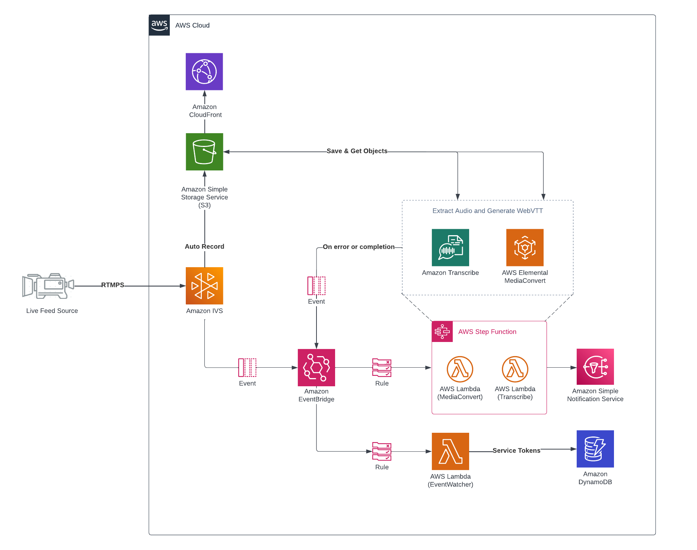
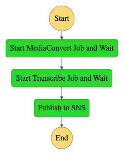

# Amazon IVS DVR Subtitles Web Demo
A demo web application intended as an educational tool for demonstrating how you can generate subtitles for Live to VOD (DVR) using Amazon IVS, the auto-record-to-s3 feature using Amazon S3, Amazon EventBridge and Amazon Transcribe.

This demo also uses [AWS Cloud Development Kit (AWS CDK v2)](https://aws.amazon.com/cdk).

## Table of contents
- [Getting Started](#getting-started)
    - [Setup](#setup)
    - [Deploy](#deploy) - TODO 
- [State Machine](#state-machine)
  - [State Machine Definition](#state-machine-definition)
  - [Execution Input](#execution-input)
- [Troubleshooting](#troubleshooting)
    - [Docker (access denied)](#docker-access-denied)


## Getting Started
The following steps describe how to deploy the solution using the Amazon Cloud Development Kit (CDK). Read more about the CDK [here](https://docs.aws.amazon.com/cdk/v2/guide/home.html).
```sh
$ git clone git@github.com:trackit/curation-tool-cdk.git
$ cd curation-tool-cdk
$ npm install
```

### Setup
The following tools need to be installed on your system prior to installing the CDK:

- [Node.js >= 14.15.0](https://nodejs.org/download/release/latest-v14.x/)
    - We recommend using a version in [Active LTS](https://nodejs.org/en/about/releases/)
- [Npm >= 8.0.0](https://docs.npmjs.com/downloading-and-installing-node-js-and-npm)
- [Docker >= 19.03](https://docs.docker.com/get-docker/)
    - the Docker daemon must also be running

## Architecture


## State Machine
The main state machine starts and waits for the MediaConvert Job to finish, it extracts an MPEG-III (MP3) audio file using the m3u master playlist file from Amazon IVS. When the MediaConvert Job successfully completes, it transitions to the Transcribe Job to generate WebVTT using speech recognition.



### State Machine Definition

```json
{
  "StartAt": "Start MediaConvert Job and Wait",
  "States": {
    "Start MediaConvert Job and Wait": {
      "Next": "Start Transcribe Job and Wait",
      "Retry": [
        {
          "ErrorEquals": [
            "Lambda.ServiceException",
            "Lambda.AWSLambdaException",
            "Lambda.SdkClientException"
          ],
          "IntervalSeconds": 2,
          "MaxAttempts": 6,
          "BackoffRate": 2
        }
      ],
      "Type": "Task",
      "Resource": "arn:aws:states:::lambda:invoke.waitForTaskToken",
      "Parameters": {
        "FunctionName": "${MediaConvertLambda}",
        "Payload": {
          "input.$": "$",
          "taskToken.$": "$$.Task.Token"
        }
      }
    },
    "Start Transcribe Job and Wait": {
      "End": true,
      "Retry": [
        {
          "ErrorEquals": [
            "Lambda.ServiceException",
            "Lambda.AWSLambdaException",
            "Lambda.SdkClientException"
          ],
          "IntervalSeconds": 2,
          "MaxAttempts": 6,
          "BackoffRate": 2
        }
      ],
      "Type": "Task",
      "Resource": "arn:aws:states:::lambda:invoke",
      "Parameters": {
        "FunctionName": "${TranscribeLambda}",
        "Payload.$": "$"
      }
    }
  }
}
```

### Execution Input

```json
{
  "version": "0",
  "id": "a4c2eacb-eaa1-fbf2-030e-6fba889e54d3",
  "detail-type": "IVS Recording State Change",
  "source": "aws.ivs",
  "account": "000000000000",
  "time": "2022-08-16T10:56:01Z",
  "region": "us-west-2",
  "resources": [
    "arn:aws:ivs:us-west-2:000000000000:channel/nc4Pffppp3333"
  ],
  "detail": {
    "recording_status": "Recording End",
    "recording_status_reason": "",
    "recording_s3_bucket_name": "storage-bucket",
    "recording_s3_key_prefix": "ivs/v1/000000000000/nc4Pffppp3333/2022/8/16/10/55/xxxxxx",
    "recording_duration_ms": 28435,
    "channel_name": "my-demo-channel",
    "stream_id": "st-XXXXXX"
  }
}
```
## Troubleshooting

### Docker (access denied)

If you face an Access Denied error from public.erc.aws related to Docker run the following:
```sh
docker logout public.ecr.aws
```
