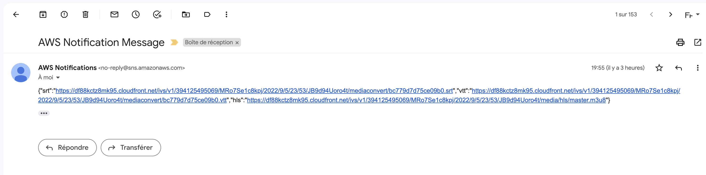
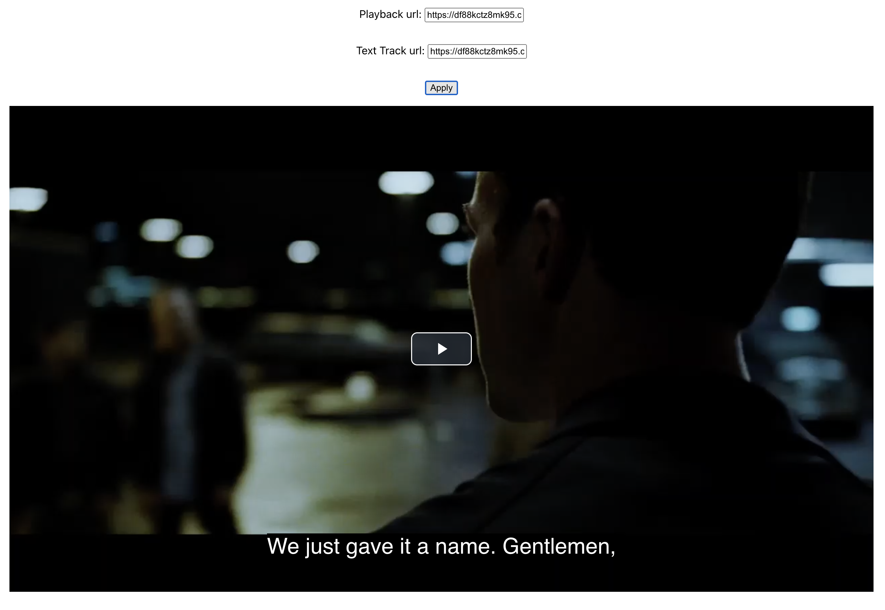

# Demo web app

This project uses:

- [Create React App](https://github.com/facebook/create-react-app)
- [video.js](https://videojs.com/)
- [gh-pages](https://github.com/tschaub/gh-pages)

## Getting started
The following steps describe how to deploy the solution using the Amazon Cloud Development Kit (CDK). Read more about the CDK [here](https://docs.aws.amazon.com/cdk/v2/guide/home.html).
```sh
$ git clone git@github.com:nathanagez/amazon-ivs-dvr-subtitles-web-demo.git
$ cd amazon-ivs-dvr-subtitles-web-demo/demo-website
$ npm install
```

### `npm start`

Runs the app in the development mode.\
Open [http://localhost:3000](http://localhost:3000) to view it in the browser.

The page will reload if you make edits.\
You will also see any lint errors in the console.

### `npm run deploy`

That will cause the `predeploy` and `deploy` scripts defined in package.json to run.

Under the hood, the `predeploy` script will build a distributable version of the React app and store it in a folder
named build. Then, the `deploy` script will push the contents of that folder to a new commit on the gh-pages branch of
the GitHub repository, creating that branch if it doesn't already exist.

## How to test generated subtitles
You can find the demo website here: https://nathanagez.github.io/amazon-ivs-dvr-subtitles-web-demo/

Simply copy and paste the playback and vtt urls received from SNS into the text inputs




Then click the "Apply" button
